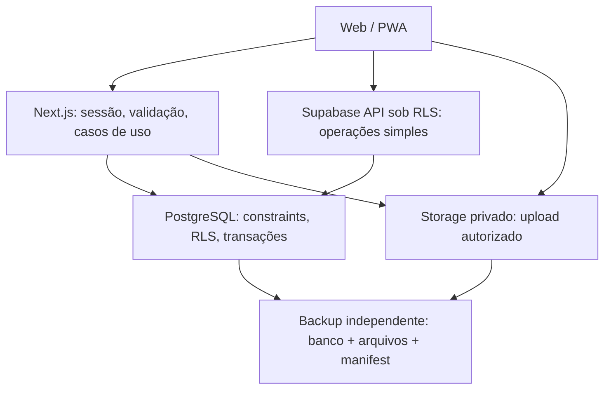

# Arquitetura e responsabilidades

## Arquitetura alvo

Monólito modular em Next.js App Router/TypeScript. PostgreSQL é a fonte dos registros; Supabase Auth cuida da identidade; Storage privado mantém arquivos. Regras ambientais e cálculos são determinísticos e testáveis. PWA é uma capacidade progressiva de campo.



RLS também se aplica quando a chamada vem do servidor com sessão da usuária. Chaves privilegiadas ficam restritas a rotinas administrativas explicitamente autorizadas; não são o caminho padrão para ignorar políticas.

## Stack

| Camada | Escolha | Aplicação |
|---|---|---|
| Web | Next.js App Router + React + TypeScript | Um app e um ciclo de entrega |
| UI | Tailwind + Radix + componentes próprios | Meridian Terra, acessibilidade e tokens centralizados |
| Formulários | React Hook Form + Zod | Validação de entrada também no servidor |
| Dados | Supabase JS + tipos gerados + migrations SQL | Sem ORM no início |
| Auth | Supabase Auth, sessão e MFA | Identidade separada de autorização por organização/unidade |
| Testes | Vitest, Playwright e testes SQL/RLS | Regras, jornadas e isolamento |
| Offline | Service Worker + IndexedDB/outbox | Apenas captura/rascunhos autorizados |
| Hosting | Vercel | Plano elegível a confirmar em OPS-01 |
| Backup | R2 como destino planejado | Banco e arquivos, com ensaio de restauração |

Versões exatas e runtime serão fixados na inicialização APP-01 após teste conjunto. Nenhum pacote está instalado neste PR documental.

## Árvore alvo

```text
.
├── src/
│   ├── app/
│   │   ├── (auth)/                 # login, recuperação e MFA
│   │   ├── (workspace)/            # rotas autenticadas
│   │   │   ├── inicio/
│   │   │   ├── trabalho/          # empresas/unidades/processos
│   │   │   ├── acervo/
│   │   │   └── configuracoes/
│   │   ├── api/                   # callbacks e endpoints necessários
│   │   └── manifest.ts
│   ├── features/
│   │   ├── identity/
│   │   ├── organizations/
│   │   ├── companies/
│   │   ├── facilities/
│   │   ├── processes/
│   │   ├── documents/
│   │   ├── waste/
│   │   ├── rapp/
│   │   ├── water/
│   │   ├── field/
│   │   ├── quality/
│   │   └── dossier/
│   ├── domain/
│   │   ├── calculations/          # funções puras, unidades e precisão
│   │   └── regulations/           # regras versionadas por jurisdição
│   ├── components/
│   │   ├── ui/                    # primitivas acessíveis
│   │   └── layout/                # navegação e estrutura
│   ├── lib/
│   │   ├── supabase/              # clientes browser/server, tipos gerados
│   │   ├── auth/                  # sessão e autorização compartilhada
│   │   ├── storage/
│   │   ├── logging/
│   │   └── offline/
│   ├── styles/                    # tokens Meridian Terra
│   └── messages/pt-BR/            # mensagens e rótulos
├── public/                        # somente recursos públicos da marca
├── supabase/
│   ├── migrations/                # schema, policies e funções versionadas
│   ├── tests/                     # grants, RLS, invariantes e transações
│   └── seed.sql                   # dados sintéticos
├── tests/
│   ├── e2e/
│   └── fixtures/                  # somente dados fictícios
├── docs/
│   ├── adr/
│   ├── architecture/
│   ├── product/
│   ├── development/
│   ├── planning/
│   └── operations/
└── .github/
    ├── ISSUE_TEMPLATE/
    ├── PULL_REQUEST_TEMPLATE.md
    └── workflows/                 # criar com o app em APP-01
```

## Como preencher cada módulo

Dentro de uma feature, começar com componentes, schemas, consultas e casos de uso concretos. Criar subdivisões apenas quando houver volume. Rotas coordenam a tela; não duplicam SQL, cálculos ou autorização. Componentes reutilizáveis não importam módulos de negócio.

Domínio não importa React, Next.js ou Supabase. Feature pode chamar domínio e adaptadores de lib; regras compartilhadas vivem em um só lugar. Acesso externo valida payload e sessão. Casos críticos chamam função transacional que verifica permissão, estado e versão, grava alteração e auditoria atomicamente.

Exemplo: resolver divergência de resíduo → validar justificativa → verificar escopo e versão → registrar resolução e evidência → atualizar pendência → emitir auditoria → apresentar resultado. Retentativa utiliza chave idempotente.

## Compatibilidade e riscos

- SQL e app evoluem por expansão compatível; backfill e remoção são etapas separadas.
- Cache autenticado nunca pode compartilhar dados entre organizações.
- Não colocar PDFs privados em public, GitHub ou logs.
- Geração de dossiê precisa de medição de tamanho/tempo antes de adotar worker. Usar serviço adicional só com necessidade demonstrada.
- Sem backend separado, message broker ou engine genérica de workflows no início.

Referências técnicas: [estrutura App Router](https://nextjs.org/docs/app/getting-started/project-structure) e [RLS Supabase](https://supabase.com/docs/guides/database/postgres/row-level-security). O arranjo de módulos acima é uma decisão do Ambientis.
