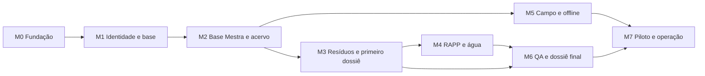

# Roadmap e milestones

Plano por resultados, sem datas ou estimativas inventadas. Definir calendário após avaliar capacidade de execução e disponibilidade da usuária. M0–M7 são milestones **planejados**; a criação nativa está pendente em GOV-02.

| Fase | Entrega | Gate de saída |
|---|---|---|
| M0 | Fundação e governança | Manual, decisões, roadmap e fluxo de contribuição revisados. |
| M1 | Base executável e identidade | App local, CI, autenticação, MFA e isolamento verificados com dados sintéticos. |
| M2 | Base Mestra e acervo | Empresa/unidade, documentos versionados e processos com rastreabilidade. |
| M3 | Primeiro fluxo completo de resíduos | Inventário demonstrável da fonte ao dossiê preliminar; piloto sempre sintético até M7. |
| M4 | RAPP e recursos hídricos | Memórias, regras versionadas e cruzamento de evidências revisados pela responsável técnica. |
| M5 | Campo e sincronização | Captura móvel e recuperação offline verificadas em dispositivos reais. |
| M6 | Revisão e dossiê final | QA-A a QA-G, manifest íntegro, protocolos e recibos com histórico. |
| M7 | Piloto e operação | Restauração testada, uso permitido pelo plano, aceite da usuária e operação documentada. |

## Dependências e entregas

M5 pode começar depois de M2 sem aguardar todos os módulos de M4, respeitando as dependências de cada issue. Segurança, acessibilidade e integridade acompanham todas as fases; M7 verifica o conjunto.

## Próximas entregas concretas

1. Revisar PR de fundação e decisões pendentes (#1).
2. Desbloquear configuração do Project e confirmar plano/integração Vercel (#2 e #3).
3. Implementar base executável (#4), então UX (#5) e identidade (#6–#7).
4. Seguir a ordem de dependências no [backlog](backlog.md).

## Regras de priorização

P0: bloqueia integridade, entrega da fase ou liberação. P1: necessário para a versão operacional, mas pode seguir a base. P2: evolução. Prioridade é relativa à fase; um P0 de M7 não exige construir o dossiê antes do cadastro.

O primeiro fluxo demonstrável (M3) utiliza dados sintéticos. A primeira versão operacional exige os gates M7. Mudanças de escopo ajustam issues e ADRs antes de reestimar.

## Milestones nativos

Para cada fase: título “M0 — Fundação e governança” (e equivalentes), descrição igual ao gate acima, sem due date até haver compromisso. Vincular cada issue conforme backlog.json; não recriar milestone homônimo. Fechar milestone somente após verificar critérios, não apenas pela contagem de issues fechadas.
